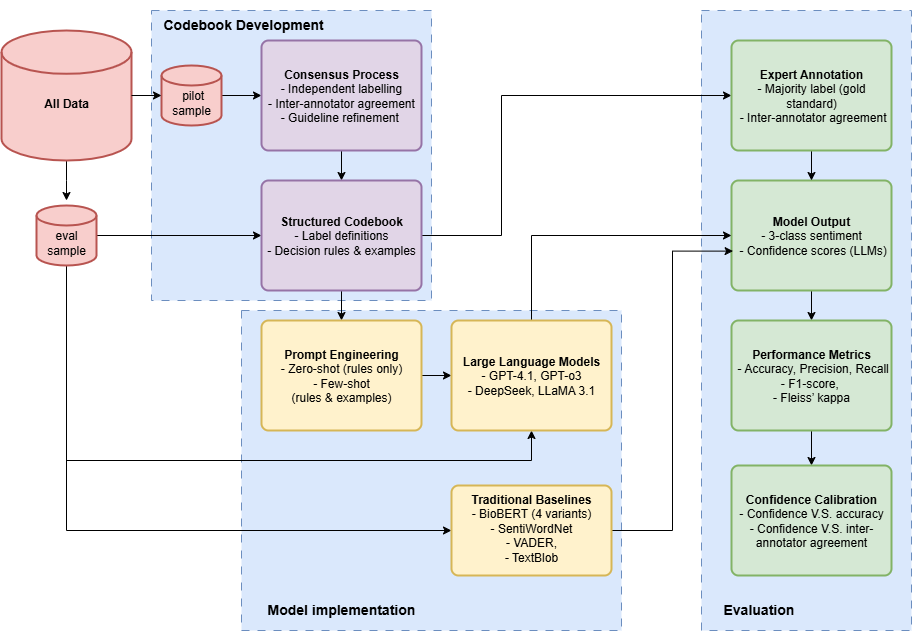

# Sentiment Analysis with Large Language Models in Digital Health

This repository contains the implementation for the research paper "The Promise of Large Language Models in Digital Health: Evidence from Sentiment Analysis in Online Health Communities."

## 🚀 Quick Start

### 1. Installation

```bash
# Clone the repository
git clone https://github.com/XianchengLI/sentiment-analysis-llm-health.git
cd sentiment-analysis-llm-health

# Or download ZIP from: https://github.com/XianchengLI/sentiment-analysis-llm-health

# Install dependencies
pip install -r requirements.txt
```

### 2. API Keys Setup

You have multiple options to set up API keys:

#### Option A: Set in Jupyter Notebook (Recommended for testing)
```python
# In your notebook
OPENAI_API_KEY = 'your_openai_key_here'    # Replace with your actual key
LLAMA_API_KEY = 'your_llama_key_here'      # Leave empty if not using
DEEPSEEK_API_KEY = 'your_deepseek_key_here' # Leave empty if not using

# Apply to environment
import os
if OPENAI_API_KEY:
    os.environ['OPENAI_API_KEY'] = OPENAI_API_KEY
# ... (similar for other keys)
```

#### Option B: Permanent Setup (Recommended for production)
```bash
# Windows Command Prompt
setx OPENAI_API_KEY "your_key_here"
setx LLAMA_API_KEY "your_llama_key_here"

# Restart Jupyter after setting keys
```

#### Option C: Using .env file
```bash
# Edit .env file in project root
OPENAI_API_KEY=your_openai_key_here
LLAMA_API_KEY=your_llama_key_here
DEEPSEEK_API_KEY=your_deepseek_key_here
```

### 3. Run Your First Experiment

```python
# In notebooks/test_experiment.ipynb
from run_experiments import run_experiment_with_custom_data

results = run_experiment_with_custom_data(
    data_path="../data/your_dataset.csv",
    models=["gpt-4o-mini", "llama3.1-70b"],
    post_id_col="PostId",           # Your post ID column
    content_col="Body",             # Your text content column  
    expert_label_col="Label"        # Your ground truth label column
)
```

## 🎯 Key Features

- 🤖 **Multi-LLM Support**: OpenAI GPT, LLaMA, DeepSeek with unified interface
- 📊 **Flexible Data Input**: Custom column names, multiple file formats
- 🏥 **Health-Domain Optimized**: Expert-derived codebook for health community analysis
- 🔄 **Zero-shot & Few-shot**: Both learning approaches implemented
- 🔒 **Privacy-Aware**: Works with synthetic data for demonstration
- 🔮 **Pure Prediction Mode**: Analyze new data without ground truth labels
- ✨ **Confidence Assessment**: Get model confidence scores for prediction reliability
- 🎛️ **Dual Mode Support**: Traditional sentiment analysis or sentiment + confidence

## 📁 Project Structure

```
sentiment-analysis-llm-health/
├── src/                           # Core modules
│   ├── data/                     # Data processing
│   │   ├── prompt_manager.py     # Prompt template management
│   │   └── sample_generator.py   # Synthetic data generation
│   ├── models/                   # LLM interfaces
│   │   └── llm_client.py        # Multi-provider LLM client
│   ├── evaluation/               # Performance evaluation
│   │   └── metrics.py           # Evaluation metrics
│   └── utils/                    # Utility functions
├── data/                         # Data directory
│   ├── prompts/                 # Prompt templates
│   │   ├── zero_shot_prompt.txt # Zero-shot learning prompt
│   │   ├── few_shot_prompt.txt  # Few-shot with examples
│   │   ├── confidence_guidelines.txt # Unified confidence assessment rules
│   │   └── base_templates/      # Base templates for confidence mode
│   │       ├── zero_shot_base.txt
│   │       ├── few_shot_base.txt
│   │       └── naive_base.txt
│   ├── sample_data/             # Generated sample datasets
│   └── real_data/               # Real datasets
├── experiments/                  # Experiment scripts
│   ├── run_experiments.py       # Main experiment runner
├── notebooks/                   # User-friendly notebooks
│   └── test_experiment.ipynb    # Example usage notebook
├── config/                      # Configuration files
├── results/                     # Experiment outputs
└── README.md
```

## 🔬 Supported Models

### OpenAI Models
- `gpt-4.1` 
- `gpt-4.1-mini` 
- `o3` 
- `o3-mini` 
- `gpt-4o`
- `gpt-4o-mini`


### LLaMA Models 
- `llama3.1-70b` 
- `llama3.1-405b` 

### DeepSeek Models
- `deepseek-chat` 
- `deepseek-reasoner` 

### Other Models
Other models may work with the structure but not extensively tested

## 📖 Usage Examples

### Traditional Mode (Sentiment Only)

```python
from experiments.run_experiments import run_experiment_with_custom_data

# Simple experiment with custom data
results = run_experiment_with_custom_data(
    data_path="path/to/your/data.csv",
    models=["gpt-4o-mini", "o3"],
    post_id_col="ID",
    content_col="PostText", 
    expert_label_col="TrueLabel",
    prompt_templates=["zero_shot_prompt", "few_shot_prompt"]  # Original prompt files
)
```

### New: Confidence Mode (Sentiment + Confidence)

```python
from experiments.run_experiments import run_experiment_with_confidence

# Experiment with confidence assessment
confidence_results = run_experiment_with_confidence(
    data_path="path/to/your/data.csv",
    models=["gpt-4o-mini", "llama3.1-70b"],
    post_id_col="ID",
    content_col="PostText",
    expert_label_col="TrueLabel",
    prompt_templates=["zero_shot", "few_shot"]  # Base template names
)

# Results include both sentiment predictions and confidence scores
for exp_name, result in confidence_results.items():
    if 'predictions' in result:
        df = result['predictions']
        print(f"Mean confidence for {exp_name}: {df['Confidence_model'].mean():.3f}")
```

### Pure Prediction - Traditional Mode

```python
from experiments.run_experiments import predict_sentiment_batch

# Predict sentiment only
results = predict_sentiment_batch(
    data_path="../data/new_posts.csv",
    models=["gpt-4o-mini", "llama3.1-70b"],
    post_id_col="PostID",
    content_col="Content",
    prompt_template="few_shot_prompt"  # Original prompt file
)

# Results: Original data + Predicted_model columns
```

### Pure Prediction - Confidence Mode

```python
from experiments.run_experiments import predict_sentiment_batch_with_confidence

# Predict sentiment with confidence scores
confidence_results = predict_sentiment_batch_with_confidence(
    data_path="../data/new_posts.csv",
    models=["gpt-4o-mini", "llama3.1-70b"],
    post_id_col="PostID",
    content_col="Content",
    prompt_template="few_shot"  # Base template name
)

# Results: Original data + Predicted_model + Confidence_model columns
print(confidence_results[['PostID', 'Content', 'Predicted_gpt-4o-mini', 'Confidence_gpt-4o-mini']])
```

### Advanced Usage with Multiple Models

```python
# Compare multiple LLM providers with confidence
results = run_experiment_with_confidence(
    data_path="../data/health_posts.csv",
    models=[
        "gpt-4o-mini",      # OpenAI
        "llama3.1-70b",     # LLaMA
        "deepseek-chat"     # DeepSeek
    ],
    prompt_templates=["zero_shot", "few_shot"],
    verbose=True,           # Show detailed progress
    output_dir="../results/confidence_comparison/"
)

# Analyze confidence calibration
for exp_name, result in results.items():
    if 'metrics' in result:
        acc = result['metrics'].get('accuracy', 0)
        mean_conf = result['metrics'].get('mean_confidence', 0)
        print(f"{exp_name}: Accuracy {acc:.3f}, Mean Confidence {mean_conf:.3f}")
```

## 📊 Data Format Requirements

Your dataset should be a CSV or Excel file. **Column names are completely flexible** - you can specify them when running experiments:

### Example Dataset Structure:

| Your Column Name | Description | Example Values |
|------------------|-------------|----------------|
| Any ID column | Unique identifier | POST_001, ID_123, message_id |
| Any text column | Text to analyze | "I feel much better after..." |
| Any label column | Expert annotations | Positive/Negative/Neutral |

**Note**: Ground truth labels are only needed for evaluation experiments, not for pure prediction.

### Usage with Custom Columns:

```python
# Traditional mode
results = run_experiment_with_custom_data(
    data_path="your_data.csv",
    models=["gpt-4o-mini"],
    post_id_col="ID",              # ← Your actual ID column name
    content_col="PostContent",     # ← Your actual text column name  
    expert_label_col="TrueLabel"   # ← Your actual label column name
)

# Confidence mode
confidence_results = run_experiment_with_confidence(
    data_path="your_data.csv",
    models=["gpt-4o-mini"],
    post_id_col="ID",
    content_col="PostContent",
    expert_label_col="TrueLabel"
)
```

**Supported formats:**
- Flexible column names: Specify any column names in your dataset
- Multiple file formats: CSV (auto-encoding detection), Excel (.xlsx)
- International text: Automatic encoding detection (UTF-8, GBK, GB2312, etc.)

### Confidence Calibration Visualization:

```python
custom_runner = ConfidenceAnalysisRunner(
    data_path="../data/sample_data/your_data.csv", 
    sentiment_mapping={-1: 'Negative', 0: 'Neutral', 1: 'Positive'},  # Adjust as needed
    true_label_col="TrueLabel"  # Adjust column name
)

# visualisation with select models and prompts
custom_results = custom_runner.run_calibration_visualization(
    models_to_test=["o3", "o3-mini"],  # Add more models like "gpt-4.1", "gpt-4.1-mini"
    prompt_templates=["zero_shot", "few_shot","naive"],  # Focus on specific prompts
    output_dir="../results/confidence_analysis_custom"
)
```

## 🔬 Research Workflow



### Overview

Our research follows a systematic four-stage pipeline that combines expert knowledge with advanced language models for health sentiment analysis:

#### 1. **Data & Codebook Development**
- **Pilot Sample Selection**: Representative subset extracted from all data
- **Consensus Process**: Expert panel conducts independent labeling, establishes inter-annotator agreement, and refines interpretation guidelines
- **Structured Codebook**: Finalized label definitions, decision rules, and annotated examples for consistent sentiment classification

#### 2. **Model Implementation**
Two parallel approaches for comprehensive evaluation:

**Large Language Models (LLMs)**:
- **Prompt Engineering**: Zero-shot (rules only) and Few-shot (rules + examples) strategies
- **Supported Models**: GPT-4.1, GPT-o3, DeepSeek, LLaMA 3.1
- **Output**: 3-class sentiment predictions + confidence scores

**Traditional Baselines**:
- BioBERT (4 variants for domain-specific comparison)
- SentiWordNet (lexicon-based approach)
- VADER (rule-based sentiment analyzer)
- TextBlob (pattern-based sentiment analysis)

#### 3. **Expert Annotation**
- **Gold Standard**: Majority voting from expert panel annotations
- **Quality Assurance**: Inter-annotator agreement metrics ensure reliability
- **Evaluation Sample**: Independent test set for unbiased performance assessment

#### 4. **Performance Evaluation**
Comprehensive multi-metric evaluation framework:

- **Classification Metrics**: Accuracy, Precision, Recall, F1-score
- **Agreement Metrics**: Fleiss' kappa for inter-rater reliability
- **Confidence Calibration**:
  - Confidence vs. Accuracy alignment
  - Confidence vs. Inter-annotator agreement correlation
  - Model uncertainty quantification

This workflow ensures rigorous methodology while maintaining flexibility for domain adaptation and model comparison.

### 🔄 Adapting to Other Text Labeling Tasks

While this framework was developed for health sentiment analysis, it can be adapted to other text classification tasks. Here's how to migrate:

#### Required Modifications

**Step 1: Develop Your Domain-Specific Codebook**
- Define clear label categories for your task (e.g., topic classification, emotion detection, urgency assessment)
- Create decision rules based on domain expertise
- Include annotated examples that demonstrate edge cases
- Establish consensus through pilot annotation with domain experts

**Step 2: Update Prompt Templates**

For **Traditional Mode** (sentiment only):
1. Edit prompt files in `data/prompts/`:
   - Replace sentiment-specific rules with your codebook guidelines
   - Update label definitions (e.g., Positive/Negative/Neutral → your categories)
   - Modify examples to match your domain

For **Confidence Mode** (with confidence scores):
1. Edit base templates in `data/prompts/base_templates/`:
   - Update core classification rules in the template
   - Keep the `{confidence_section}` and `{response_format}` placeholders
   - The system will automatically inject confidence guidelines

**Step 3: Define Confidence Scoring (Optional)**

If using confidence assessment, define domain-specific confidence criteria in `data/prompts/confidence_guidelines.txt`:

```
High Confidence (0.8-1.0):
- Clear domain-specific indicators present
- Unambiguous feature patterns
- Strong alignment with codebook rules

Moderate Confidence (0.5-0.7):
- Some ambiguity in feature interpretation
- Partial match with multiple categories
- Context provides reasonable certainty

Low Confidence (0.0-0.4):
- Mixed or contradictory signals
- Insufficient context
- Edge cases not covered by codebook
```

#### Example: Migrating to Emotion Detection

```python
# Original: Health Sentiment Analysis
labels = ["Positive", "Negative", "Neutral"]

# New Task: Emotion Detection
labels = ["Joy", "Sadness", "Anger", "Fear", "Surprise", "Neutral"]

# Update prompts with emotion-specific rules:
# - Joy: Expressions of happiness, satisfaction, excitement
# - Anger: Frustration, complaints, aggressive language
# ... (continue with your codebook)
```

#### 📢 Important Performance Validation Notice

> **⚠️ STRONGLY RECOMMENDED**: Follow our complete workflow for rigorous performance evaluation when adapting to new tasks.
>
> - **Our experiments validate performance specifically for sentiment analysis** in health communities
> - **Other text labeling tasks may show different performance patterns** depending on:
>   - Task complexity and label granularity
>   - Domain-specific language characteristics
>   - Codebook quality and clarity
>   - Data distribution and edge cases
>
> **Before production deployment**, you MUST:
> 1. Follow the 4-stage workflow with your domain data
> 2. Conduct thorough performance evaluation with expert-annotated gold standard
> 3. Compare multiple models and prompt strategies
> 4. Validate confidence calibration if using confidence scores
> 5. Select the most appropriate model based on YOUR task-specific metrics
>
> **Model performance is task-dependent** - what works for sentiment analysis may not be optimal for your specific use case. Always validate empirically.

---

## 🎛️ Configuration

### Confidence Assessment

The confidence feature uses unified guidelines that assess model certainty on a 0-1 scale:

- **0.9-1.0**: Very High - Unambiguous sentiment with clear indicators
- **0.7-0.8**: High - Clear sentiment with strong supporting evidence  
- **0.5-0.6**: Moderate - Reasonably clear with some ambiguity
- **0.3-0.4**: Low - Mixed or unclear sentiment signals
- **0.1-0.2**: Very Low - Highly ambiguous or contradictory
- **0.0**: No confidence - Cannot determine sentiment

### Custom Prompt Templates

**Traditional Mode:**
Create prompts in `data/prompts/`:
```
data/prompts/
├── zero_shot_prompt.txt      # Complete prompt with fixed format
├── few_shot_prompt.txt       # Complete prompt with examples
└── custom_domain_prompt.txt  # Domain-specific complete prompt
```

**Confidence Mode:**
Create base templates in `data/prompts/base_templates/`:
```
data/prompts/base_templates/
├── zero_shot_base.txt        # Core content with {confidence_section}, {response_format}
├── few_shot_base.txt         # Core content with placeholders
└── custom_base.txt           # Custom base template
```

### Model Configuration

Edit `config/models.yaml` to adjust model parameters (applies to GPT models that support these parameters):

```yaml
models:
  gpt-4o-mini:
    temperature: 0.0
    max_tokens: 50
```

## 🔧 Troubleshooting

### Common Issues

#### 1. Encoding Errors
```python
# The system automatically tries multiple encodings:
# UTF-8, GBK, GB2312, Latin-1, CP1252
# No manual intervention needed
```

#### 2. API Key Issues
```python
# Check if keys are properly set
import os
print("OpenAI key set:", bool(os.getenv('OPENAI_API_KEY')))
print("LLaMA key set:", bool(os.getenv('LLAMA_API_KEY')))
```

#### 3. Model Not Available
```python
# Check available models based on your API keys
from src.models.llm_client import LLMClient
client = LLMClient()
available = client.get_available_models()
print(f"Available models: {available}")
```

Note that the base URL of LLAMA may change in the future. If you get a connection error while using LLAMA models, please check the official site for updates.

#### 4. Confidence Feature Issues
```python
# Check if base templates exist
import os
base_templates_dir = "data/prompts/base_templates"
required_files = ["zero_shot_base.txt", "few_shot_base.txt", "naive_base.txt"]
for file in required_files:
    exists = os.path.exists(os.path.join(base_templates_dir, file))
    print(f"{file}: {'✅' if exists else '❌'}")

# Check confidence guidelines
conf_file = "data/prompts/confidence_guidelines.txt"
print(f"Confidence guidelines: {'✅' if os.path.exists(conf_file) else '❌'}")
```


#### 5. HTTP Request Logs
```python
# HTTP request logs are disabled by default
# To ENABLE detailed HTTP logging (for debugging), uncomment these lines:
# import logging
# logging.getLogger("httpx").setLevel(logging.INFO)
# logging.getLogger("openai").setLevel(logging.INFO)
```

## 📈 Research Methodology

### Expert Knowledge Integration

Our approach uses a structured codebook that encodes expert-derived interpretation guidelines. **You can customize these rules for your own domain by editing the prompt templates.**

#### Complete Rule Set:

1. **Improvement and Self-management**: Health improvement or effective symptom control → **Positive**
2. **Uncertainty**: Vague, unclear, or non-personal experiences → **Neutral**
3. **Objective Information**: General facts without personal reference → **Neutral**
4. **Polarized Sentiment from Emphasis**: Strong emphasis ("really helped", "so much worse") → **Positive/Negative**
5. **Helpful Advice or Resources**: Sharing tools, tips, or resources → **Positive**
6. **Tone Sensitivity**: Negative experiences ending with hope/support → **Positive**
7. **Punctuation Sensitivity**: Exclamation marks amplify emotion, question marks suggest uncertainty
8. **Health Struggles**: Pain, treatment failure, emotional hardship → **Negative**
9. **Prioritize Polarized Sentiment**: Emotional content overrides neutral elements

#### Confidence Assessment Integration

The confidence feature adds an additional layer of reliability assessment:

- **Emotional Language Clarity**: Explicit positive/negative words increase confidence
- **Content Ambiguity**: Mixed emotions or neutral facts decrease confidence
- **Personal vs General**: Personal experiences typically have clearer sentiment
- **Linguistic Certainty**: Definitive statements vs uncertain expressions
- **Context Completeness**: Sufficient context vs fragmented information

```

## 📄 Citation

If you use this code in your research, please cite our paper (to publish):

```bibtex

```

## 📧 Contact

- **Corresponding Author**: Xiancheng Li (x.l.li@qmul.ac.uk)
- **Issues**: Please use the GitHub issue tracker for questions and bug reports
- **Discussions**: GitHub Discussions for research questions and methodology

**Note**: This implementation uses synthetic sample data for demonstration purposes. The original research data cannot be shared due to privacy constraints, but the methodology and code structure remain faithful to the published research.